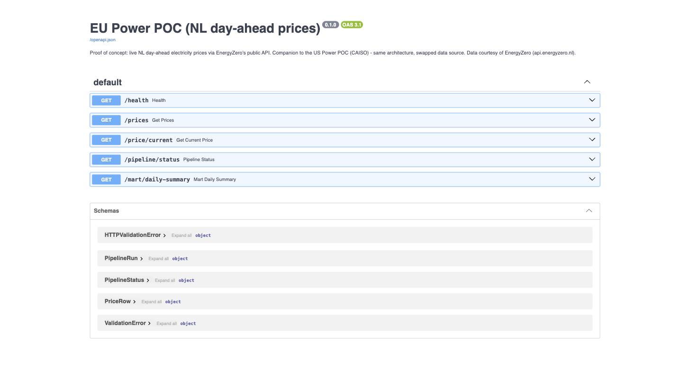

# EU Power POC (NL day-ahead prices)

[](https://github.com/JonathanThangadurai/eu-power-poc/actions/workflows/ci.yml)

**This is a proof of concept**, and a companion to [us-power-poc](https://github.com/JonathanThangadurai/us-power-poc):
same architecture (scheduled ingestion -> idempotent Postgres storage -> FastAPI -> self-monitoring),
different market. This one pulls **NL day-ahead electricity prices** instead of CAISO's US wholesale
prices, as the data source for a separate project (a Renewable Energy Community marketplace) that
needs a real EU price instead of a hardcoded constant.

Kept **local-only** (docker-compose), not deployed, since this exists to prove the integration
works, not to stand as a second public demo.



## Attribution

Price data is sourced from **EnergyZero**'s public API (`https://api.energyzero.nl/v1/energyprices`),
queried anonymously with no API key or account. This mirrors the CAISO POC's "anonymous, reproducible"
requirement, though EnergyZero is a retail energy supplier's API (re-publishing NL day-ahead auction
results), not the grid operator itself - the closest NL grid-operator equivalent to CAISO would be
TenneT's settlement-price API, which requires a developer-portal registration.

## What's different from the CAISO POC

- **No zip/CSV/pivot.** EnergyZero returns plain JSON, one row per hour already - there's no
  one-row-per-price-component structure to pivot, unlike CAISO's CSV.
- **No DAM/RTM split.** There's one market here: day-ahead, hourly. No 5-minute real-time feed.
- **Empty results are usually legitimate, not a trap.** Querying a future date before EnergyZero's
  ~15:00 CET publish time correctly returns `"Prices": []` with HTTP 200 - that's expected, not an
  error. `app/ingest.py` only treats an empty result as a failure when the requested window is in
  the past or present (i.e. should already be published).
- **Both VAT variants are stored.** `price_excl_vat_eur_per_kwh` (closer to the real wholesale
  price - this is what feeds the Marketplace integration) and `price_incl_vat_eur_per_kwh` (what a
  household actually pays) are both kept.
- **A `/price/current` endpoint** exists specifically for other services to consume "the current
  price" as a single value, rather than parsing a list from `/prices`.

## Running it

```bash
cp .env.example .env
docker compose up --build
```

- API: http://localhost:8001/docs (host port 8001, container port 8000 - chosen so this can run
  alongside the CAISO POC's compose stack without a port clash)
- Postgres is exposed on host port 5433 for the same reason.

### Backfill

```bash
python -m scripts.backfill --start 2026-09-01T00:00:00+00:00 --end 2026-09-08T00:00:00+00:00
```

### Tests

```bash
pytest -v   # uses real recorded EnergyZero responses in tests/fixtures/, incl. the empty-future-date case
ruff check .
```

## Data lineage: raw -> staging -> mart

Same layering as us-power-poc:

1. **Raw** (`raw_prices`): the untouched EnergyZero response, once per `pipeline_runs` row.
2. **Staging/conformed** (`prices`): normalized one-row-per-hour records. **A batch only reaches
   this table if it passes all three quality checks** - checks run before loading, not after.
3. **Quarantine** (`quarantine_prices`): a batch that fails a check lands here instead, tagged with
   which check failed and the `pipeline_runs` id that produced it.
4. **Mart** (`mart_daily_summary` - a SQL view over `prices`): daily avg/min/max/stddev, read by
   `GET /mart/daily-summary` instead of being recomputed inline.

Schema changes go through Alembic (`migrations/`), not ad-hoc `CREATE TABLE IF NOT EXISTS` - see
us-power-poc's README for why revision `0001` is deliberately idempotent (safe baseline against a
database whose tables predate Alembic's adoption).

## API

- `GET /health`
- `GET /prices?country=NL&start=...&end=...&limit=&offset=`
- `GET /price/current?country=NL` - the single price for the current hour; what the Marketplace
  integration calls.
- `GET /mart/daily-summary?country=NL&limit=&offset=`
- `GET /pipeline/status`
- `GET /docs`

## Monitoring

Same three checks as the CAISO POC, run on the fetched batch **before** it's loaded anywhere:
freshness (is the newest hour *in this batch* not stale - negative "age" is normal here, since
day-ahead prices are published ahead of time), duplicate keys, and null prices - written to
`pipeline_runs`, visible at `/pipeline/status`. A passing batch goes to `prices`; a failing one goes
to `quarantine_prices` instead. See `tests/test_quarantine.py` for this verified with a crafted
duplicate-key batch.

## Known limitations

Same POC-scope limitations as us-power-poc (no mypy, no Prometheus) plus: single country (NL), no
deployment (local-only by design for this integration), and EnergyZero is a retail supplier's
republished feed rather than a primary grid-operator source.
